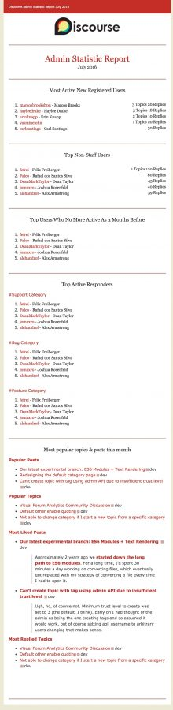
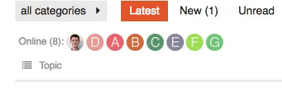

# Goals

The goal of Agora is too be a fast lightweight forum with plenty of functionality to do what you need your forum to do.

## Builtin Plugins

This is a non exhaustive list of plugins/extensions that other modern forums (discourse, flarum, nodebb) use that would be nice to have baked into Agora. There are not ordered by importance. If(and/or when) the functionality of these plugins/extensions come to agora they will likely only be usable through a configuration file or settings menu (not on by default).

### 1. Question and Answers

**References**

1. [**Discourse** Question Answer](https://github.com/paviliondev/discourse-question-answer)
2. [**Discourse** Solved](https://github.com/discourse/discourse-solved)
3. [**Flarum** Best Answer](https://github.com/wiwatsrt/flarum-ext-best-answer)
4. [**NodeBB** Question and Answer](https://github.com/NodeBB/nodebb-plugin-question-and-answer)

### 2. Tooltip

**References**

1. [**Discourse** Tooltip](https://github.com/discourse/discourse-tooltips)

### 3. Admin Statistics

* This plugin provides you a monthly overview of your forum in  very simple report. This can help you keep track of your forum  performance and give some hints on where you need to improve. Check out  screenshots below.

**References**

1. [**Discourse** Admin Statistics](https://meta.discourse.org/t/admin-statistics-report/50943)

### 4. Chat

**References**

1. [**Discourse** Babble Chat](https://github.com/gdpelican/babble)

### 5. Events

* This plugin allows you to associate datetime ranges with topics and list those topics in the chronological order of their datetime ranges. In  other words, it lets you manage events in Discourse. This means you can  have separate Discourse category for events where you can specify time  with events and they will be sorted by that.

**References**

1. [**Discourse** Events](https://github.com/angusmcleod/discourse-events)

### 6. Location

* This plugin allows you to associate locations with topics, and list  topics with locations on a map. Locations can be turned on for specific  categories by toggling ‘Allow locations to be added to topics in this  category’ in the Category settings. The composer will include an ‘Add  Location’ button when composing a new topic in that category. Map’ will  be added to the category nav items. This will display a map in place of  the topic list with topics that have geocoded locations associated with  them marked on it. This list can be set as the default for the category  in the category settings. The location details will appear underneath  the topic title. If the location is geocoded a ‘Show Map’ button appears to the right of the location details. This button toggles a mini-map  showing the location. May admin location functionalities are provided.

**References**

1. [**Discourse** Location](https://github.com/angusmcleod/discourse-locations)

### 7. Who is Online

* This Discourse plugins help you show a list of active users on your site with their avatars which can help improve the credibility of your site. This Plugin provides several options for controlling the number of the  users to be shown and when to show and when not to show them.

**References**

1. [**Discourse** Who is Online](https://github.com/davidtaylorhq/discourse-whos-online)

### 8. Topic Previews

* This amazing plugin let you show topic excerpt and thumbnail on the  homepage along with the topic title. There are several settings you can  configure to match your site needs. This Plugin will pick the first  image from the topic and shows it on the homepage. You can manually  control all the function displayed.

**References**

1. [**Discourse** Topic Previews](https://github.com/angusmcleod/discourse-topic-previews)

### 9. Spoiler Alert

* Inspired by [spoiler-alert](http://joshbuddy.github.io/spoiler-alert/) jQuery plugin
* Don't spoil it! Hide anything with a bit of blur. Hint on mouseover. Reveal on click.

**References**

1. [**Discourse** Spoiler Alert](https://github.com/discourse/discourse-spoiler-alert)

### 10. Data Explorer

* This plugin allows admins to run SQL queries against the live Discourse database, including parameterized queries and formatting for several common column types. For [more info](https://meta.discourse.org/t/data-explorer-plugin/32566)

**References**

1. [**Discourse** Data Explorer](https://github.com/discourse/discourse-data-explorer)

### 11. Canned Replies

* This plugin provides you with an easy way to create canned templates for your forum and posts them where ever you want. This reduces workflow and makes it much easier for you to maintain larger communities.

**References**

1. [**Discourse** Canned Replies](https://github.com/discourse/discourse-canned-replies)

### 12. Discussion Views

* Track how much times a discussion has been viewed.

**References**

1. [**Flarum** Discussion Views](https://github.com/MichaelBelgium/flarum-discussion-views) 

### 13. Markdown Preview

* Render markdown as it is being typed

**References**

1. [**Flarum** Pipe Tables](https://github.com/KevID/flarum-pipetables) * this plugin only does tables

### 14. Github Autolink

* Convert references to Github issues and commits automatically into links.

**References**

1. [**Flarum** Github Autolink](https://github.com/sijad/flarum-ext-github-autolink)

### 15. Contact User

* User contact information

**References**

1. [**Flarum** Contact User](https://github.com/ffRunKey/contact)

### 16. Mentions

* Mentioning another user with "@username" will send them a notification allowing them to join the conversation instantly. You can even mention groups, handy for getting the attention of a handful of people at a time.

### 17. Gamify

* Gamify your community by awarding users with badges and medals for  contributing content, helping out other members, or simply being a  role-model user.  

### 18. Miscellaneous

* [**Profile Link**]( https://github.com/discourse/twitter-profile-link)
  * This plugin automatically adds users twitter profile link on their profile, if they ever authenticated with Twitter.
  * Could likely be expanded to more things
* [**Auto More**](https://github.com/noriods/automore)
  * Automatically clicks the 'load more' button when it comes into view.

## Authentication

* Auth0
* Azure AD
* CAS
* Discord
* Dropbox
* Facebook
* Firebase
* Github
* Gitlab
* Google
* LDAP / Active Directory
* Local
* Microsoft
* Generic OAuth2
* Generic OpenID
* Okta
* SAML 2.0
* Slack
* Twitch

## Analytics

* [Ackee](https://ackee.electerious.com) (open source)
* Application Insights
* Baidu Tongji
* [Countly](https://count.ly) (open source)
* Elasticsearch APM RUM
* [Fathom Analytics](https://github.com/usefathom/fathom) (open core)
* [Freshlytics](https://github.com/sheshbabu/freshlytics)  (open source)
* FullStory
* [GoatCounter](https://www.goatcounter.com) (open source)
* Google Addsense
* Google Tag Manager
* [Matomo](https://matomo.org/)  (open source)
* New Relic Browser
* [Open Web Analytics](http://www.openwebanalytics.com/)  (open source)
* StatCounter
* Yandex Metrica

## Databases

* PostgreSQL (First priority)
* MySql / Mariadb
* SQLite3
* [sled](https://github.com/spacejam/sled) / Whatever sqlx adds support for

## Additionally

List of some more nice to haves

* Polls
* Ability to create more buttons
* Revenue
  * Google [Adsense]( https://github.com/discoursehosting/discourse-adsense)
* Donations
  * Stripe
  * Links to Librepay, OpenCollective
* Emoji selector
* Easily make custom footer and navbar
* Multiple navbars?
* Builtin [Spam Blocker](https://github.com/zenoxygen/bayespam)
* Desktop Notifications
* Notification in navbar
* Reactions
* Screen reader support
* opengraph tags and render (Need to build, [good place to start](https://github.com/mobomo/opengraph/blob/master/lib/opengraph.rb))
* [Seo tags](https://github.com/v17development/flarum-seo)
  * Adds SEO tags (probably a good reference to look at while templating)
* Iframely / oembeds tags
* [Microformat](http://microformats.org/wiki/microformats2) tags
* Use [lemmy](https://github.com/LemmyNet/lemmy)’s hot sorting algorithm
* [Render Markdown](https://github.com/raphlinus/pulldown-cmark)
  * Render code fences with [syntax highlighting](https://github.com/trishume/syntect)
* Sitemap Generator
